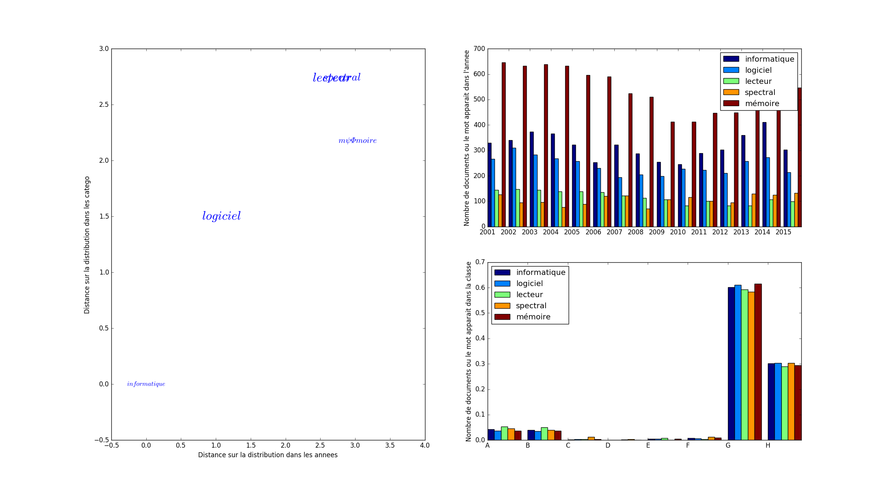
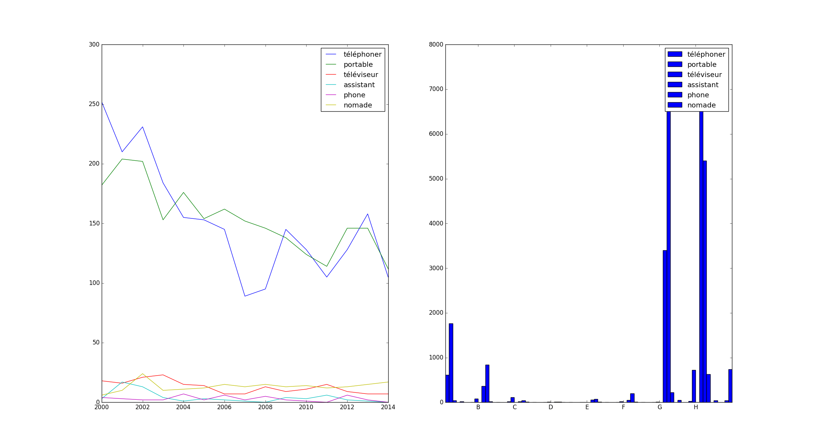
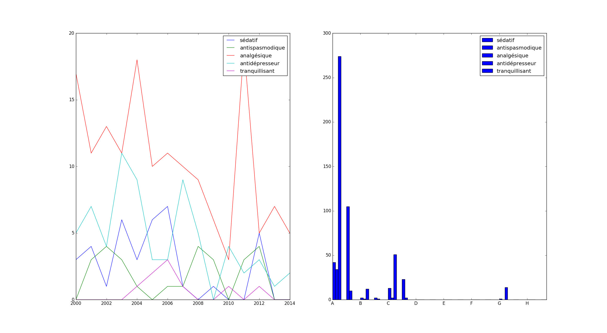

# hackatal2017 team karaoké

## Descriptif de la tâche

Voir https://github.com/HackaTAL/2017
Tache 2. Identification des tendances stratégiques liées aux brevets

## Slides

Voir https://github.com/nicolasdugue/hackatal2017/blob/master/slides/hackatal2017.pdf

## Installation

To run the code, one needs:

numpy, matplotlib, sklearn, gensim


## Exploring the INPI database

### Pré-traitements 

#### Les années 

Nous supprimons les dossiers 2000, 2016 et 2017 qui contiennent beaucoup moins de brevets afin d'éviter tout biais.

#### Le vocabulaire

Nous avons procédé à une lemmatisation avec **Lefff** et nous obtenons ainsi le fichier **vocLemma.tsv**
qui décrit le vocabulaire que nous considérons lors de nos traitements.

Nous avons la possibilité de filtrer ce vocabulaire en utilisant **filtre.py** sur trois critères :
- un filtre sur les fréquences basses dans le corpus ;
- un filtre sur le nombre de documents dans lequel le mot doit apparaitre au maximum (de façon à éviter le vocabulaire trop générique) ;
- le nombre de classe dans lequel le mot doit apparaitre au maximum (même raison).

Par ailleurs, nous opérons des filtres sur les mots qui apparaissent une seule année, qui sont des digit(), etc...


### Les fonctionnalités

#### Les distances

Pour être capables de discerner des tendances, des patterns d'évolution dans le corpus, nous nous intéressons en particulier aux **co-évolutions** entre les mots du vocabulaire. Pour les détecter, nous créons d'abord une représentation de notre vocabulaire dans le corpus en nous basant principalement sur deux axes : l'axe **temporel** des années, et l'axe des **catégories** que nous appellerons parfois **clusters** ou **groupes**. Nous considérons ici les grandes catégories de brevet(A, B, C, ..., H -> voir web2.wipo.int/classifications/ipc/ipcpub?notion=scheme&version=20170101) pour nous simplifier la tâche. Par ailleurs, les résultats obtenus semblent pertinents empiriquement.

Un mot de notre vocabulaire est ainsi représenté par deux histogrammes :
- le nombre de documents dans lequel le mot apparait chaque année ;
- le nombre de documents dans lequel le mot apparait pour chaque cluster.

A partir de cela, il devient possible de comparer les évolutions de deux mots : selon leur présence dans les classes et dans les années.
Pour cela, nous optons pour des distances sur les histogrammes : euclidiennes ou la divergence de Kullback-Leibler que nous rendons symétrique en l'utilisant dans les deux sens.
Lorsque nous nous intéressons à un mot, il est donc possible de calculer la distance de ce mot aux autres mots du vocabulaire sur ces deux axes. Pour obtenir un chiffre unique de distance, nous prenons le max des deux distances (sur l'axe temporel et sur l'axe catégoriel). Prendre le max permet de pénaliser les termes proches en terme de distribution sur les années mais pas dans les classes, et inversement.

Ce résultat est implémenté dans **plotDistance.py**. 
Exemple avec le terme *informatique* :
```
python plotDistance.py informatique
```

ou avec *lentille*
```
python plotDistance.py lentille
```
où l'on observe des proximités intéressantes.
  
#### Les embeddings

Intuitivement, il peut être sensé de penser qu'un mot très fréquemment utilisé dans le contexte d'un autre va suivre une distribution proche de celui-ci.
Pour vérifier cela, nous avons appris des embeddings sur le corpus, et il est possible de visualiser la distribution de l'embedding d'un mot à l'aide du fichier **neighbours.py**
Exemple avec le terme *sida* où l'on voit des tendances sur le nombre de brevets chaque année sur les maladies, notamment une forte décroissance au début sur quasiment tous les mots proches (en abscisse les années, en ordonnée le nombre de document dans lequels le mot apparait) :
```
python3 neighbours.py sida
```


ou encore avec *smartphone* où les tendances sont encore plus nettes, on voit diminuer l'utilisation des mots *téléphone* et *appeler* :
```
python3 neighbours.py smartphone
```


ou avec *anxiolytique* qui montre la baisse du nombre de brevets ces dernières années sur les médicaments liés au maladie induisant une souffrance psychique :
```
python3 neighbours.py anxiolytique
```



#### Les clusters

Cette dernière partie permet une vision plut en hauteur des données. Il s'agit de considérer l'évolution des clusters à travers les mots qui leur sont caractéristiques.
Nous découpons ainsi dans cette partie le corpus en grandes périodes de plusieurs années ou les documents dans les mêmes clusters sont considérés ensemble. Dans chaque période, on considère pour chaque mot d'un cluster son score de représentativité et de spécificité relativement aux autres clusters en utilisant la feature f-mesure introduite par Lamirel et al.
Nous trions ensuite les mots selon leur valeur de feature f-mesure. Et dans chaque période, nous regardons la position du mot : à quel décile appartient-il. 

Les mots stables sont les mots qui permettent d'étiqueter le cluster dans le temps et qui décrivent ainsi les grands thème du cluster.

Les mots qui évoluent représentent des thématiues émergentes ou mourantes.

Dans le dossier *clusters/*, on trouve des *matrixN* et des *clusteringN.mx* avec *N \in {1,...,5}* (les 5 périodes de 3 ans que nous considérons) qui sont des fichiers qui décrivent respectivement l'appartenance des fichiers de la période aux cluster, et la fréquence d'apparition des mots du vocabulaire dans les documents de la période.
si N=1, alors nous étudions les documents allant de 2001 à 2003.

Pour voir l'utilisation plus en détail, rendez-vous dans le dossier
https://github.com/nicolasdugue/hackatal2017/tree/master/clusters/SpecifitesParCluster

Cette approche est inspirée de celle développée dans le projet ISTEX-R dont les résultats sont visibles ici : https://github.com/nicolasdugue/istex-demonstrateur

#### Les spécificités

Le principe est ici de voir les années et le domaines où un terme est le plus spécifique. Cela permet de voir l'évolution de son usage et de l'inscrire immédiatement dans une époque.
Nous avons adapté la mesure TF-IDF habituellement utilisée pour l'usage des termes à l'intérieur des documents à leur usage à travers les années et les domaines.
Selon la spécificité, nous établissons le classement par ordre décroissant des domaines et des années pour le terme choisi.

Utilisation ici : https://github.com/nicolasdugue/hackatal2017/tree/master/specificitiesInCorpus
